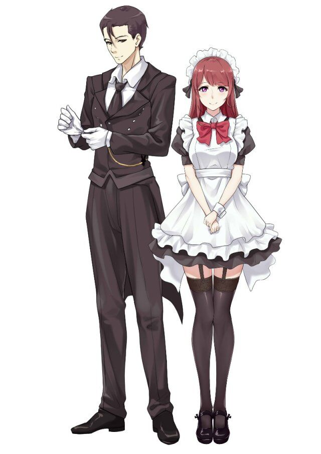

# 咖红之馆
缘莺学园女仆执事部直属原区，位于缘莺市市郊的一座哥特风贵族宅邸，除此之外还有美丽的庄园和别致的庭院，但更出名的则是全岛独一无二的女仆执事咖啡厅。  
这里是全缘莺岛女仆执事文化最特别的地区，宅邸里都是女仆和执事，但却没有侍奉的主人。而每年的“咖红之馆开放日”来临的时候，女仆和执事们才会开始迎接他们的主人。女仆们和执事们都有自己的队长，负责管理所有的成员。活动日常基本上是礼仪训练、家事管理，偶尔还会有撸猫、茶话会等奇怪的活动。
相传宅邸内有一本记录了成员平常日常的记事录。  

## 角色

### 玛丽塔
  

左：路易 右：玛丽塔  

**请问您想来点氢氧化钠到咖啡里面吗？**  
女仆队的队长，外表成熟端庄，与其说是女仆不如说她更适合大小姐平常时总会面带微笑，与人相处时明明给人一种举止优雅的大小姐般的感觉，却总会在不经意间说一些很腹黑的话语。例如在为客人上红茶的时候不时会暴露出听起来很危险的化学符号，有着隐藏的S属性。  
喜欢捉弄果茶，常常强迫他穿上女仆装，即使果茶拼命抵 抗她却总能通过忽悠、绑架、恐吓等方式让他束手就擒，对于果茶来说是非常恐怖的存在。看上去给人像是漫画里几乎万能的完美女性，不过，她确实在很多方面非常出众，但明明身为女仆家事技能却非常糟糕，在咖啡厅开放之日的时候经常搞错菜单，但总能用非常“礼貌”的方式蒙混过关。  
非常不擅长料理，有时候在厨房会表现出非常天然的一面。果茶对她的评价是“明明是Boss级的精英却要努力做好杂兵的工作一样”。由于在其他人看来她是非常完美的，不想被人看到自己不行的一面，因此在这方面经常需要果茶帮忙收拾残局，维护自己的完美形象。所以自己虽然经常捉弄果茶，但是内心对他十分感激，私下里也努力练习料理，希望自己不要给他添太多麻烦。  
喜欢撸猫，经常拍一猫片，甚至有给猫换上量身定做的女仆装的想法。  
实际上还是个腐女，经常幻想着果茶和风太的BL画面，有时候会兴奋到露出很糟糕的表情。  
本人确实是曾经的大小姐，在原来的世界中家族为有名的贵族，但因为一段过去家境没落，来到原色世界的咖红之馆成为女仆，目的也是为了让家族重新复兴。  

### 路易
玛丽塔的哥哥。前任的执事队队长。  
外表风度翩翩，举止也显得比玛丽塔更加优雅，有着高贵的贵族气质。非常喜欢照料花卉，时常把玫瑰花瓣放在口袋中，在自己登场的时候把它拿出来洒在空中衬托自己的闪亮登场。  
虽然看起来确实是一个绅士，但却是一个十足的怪人。内心极度自恋，甚至认为自己穿上女仆装也是全世界最美的，常常会穿着女仆装在众人面前自称自己是玛丽塔的姐姐，不过其形象确实看起来非常漂亮，完美符合玛丽塔心目中女仆长的形象。  
经常对风太指导执事之道，可每次都让他在拉拉面前倒了大霉。  
本人实际上是咖红之馆真正的管理者，有着强大的实力，在各方面几乎全能的存在，作为肩负艾因斯瓦特家复兴重任的掌门人，有着非常复杂的背景，但有一点可以肯定的是，他有着对咖红之馆与缘莺岛世界绝对的忠诚。

### 拉拉(菲利克斯)
请叫我菲利克斯·冯·路德维希  
执事队的队长，身着执事装的时候外表看上去像是英俊潇洒的贵族美少年，但实际上是女孩子。嘴上经常挂着贵族绅士的口吻，自称自己是“菲利克斯·冯·路德维希”，脸上时常挂着具有诱惑力的美男子笑容，有着大量的女性粉丝，因此也常被人怀疑是不是有百合倾向，不过本人却笑而不答。
有着高冷的气质，但其实只是装出来的，在面对风太有时候会被打破高冷的外表，看似优雅沉稳的她老是会被风太的骚话搞得不知所措，偶尔甚至会露出非常少女的一面。  
明明是连鬼都不怕的人，却对小狗有着异常的恐惧，不过这个弱点只有玛丽塔和风太知道。  
果茶女装的二号罪恶之源，能做到让他光速换装。  
非常喜欢可爱的猫咪，对猫耳没有免疫力，经常因为这样秒变被萌杀的少女，常与玛丽塔去猫咖撸猫。  
有着不俗的战斗技能，属于咖红之馆与玛丽塔并称的守护神一般的存在。与玛丽塔之间关系非常信任，经常被其他女仆执事幻想为非常般配的一对，但实际上她们之间的感情算是女孩子之间非常纯粹的友情，两个人私下也会谈论一些女孩子之间经常讨论的话题。

### 风太
咖红之馆的执事。原名为“拿铁”，是一个行动代号。本是受人委托潜入咖红之馆刺杀主人的刺客，但被拉拉制服，并发现自己被人骗了接受了虚假的委托，刺杀的目标根本不存在（咖红之馆根本没有主人）。由此处于被通缉的状态，但被玛丽塔收留成为执事。  
本人为左撇子，擅长左手匕，拥有不凡的身手，速度上比拉拉强大，但是技巧和经验上不及拉拉。曾憧憬拉拉的强大，但是当知道她是女孩子后非常意外，下决心要超越她并成为能保护她的人。  
本人看上去比外表健谈，经常骚话连篇，是菲利克斯（拉拉）的优雅腔调的头号克星。  
不习惯贵族的礼仪和姿态，经常被拉拉严厉纠正，但本人却意外地感到高兴（抖M？）。  
曾认不出女仆装后的果茶，也差点对他心动。但实际上两个人之间可以说是死党一样的存在，经常会一起行动做很沙雕的事情。  

### 果茶
我是执事啊……不是女仆！GC也不是什么Girls’ clothes的缩写！  
咖红之馆的新执事（女仆？）。外表清秀，有着女孩子般纤细的身材，初次见面的时候被风太误认为是女孩子而直接带到了玛丽塔的面前，此后即使自己拼命澄清自己是男孩子的事实，也被玛丽塔强迫换上女仆装，其名字被玛丽塔强行解读为“Girls’ clothes（女装）”缩写后的GC的暗号。换上女仆装后一度让男执事们在什么天使与恶魔的思想边缘崩溃。但本人向往执事的帅气，想成为一位有男子汉之魂的执事。不过拉拉虽然口头让他加入执事队，但却经常让他换上女仆装，而且处处受到玛丽塔的控制，让他现在处于归属不明的状态。  
很多次被GG那强大的男子气魄所打动，但又对他身着女仆装难以接受。“非常地……有男人的气概啊！但是，为什么要穿着女仆装啊GG先生！！！”  
实际上本人有着很强的男子力，非常擅长料理，家事方面也极其突出。虽然本人对玛丽塔有着莫名的恐惧，但当她陷入困境的时候总会去救助，多次帮助玛丽塔搞定高难度的料理和家务，保持她在常人看来的完美形象。也因此看到玛丽塔私下非常不一样的一面，一瞬间意识到玛丽塔也是非常普通的女孩子后心动了。  

### GG
女仆装是——男人的修炼啊！！！  
咖红之馆的“女仆”，但毫无疑问是一个满身肌肉的男性。认为“男人只有敢于接受女仆的试炼才能达到超越性别的强大”，因此每天都穿着女仆装。明明能说出一些很帅气的话，但却穿着女仆装，这一点让果茶又仰慕又失望。本人实际上确实很可靠，经常会给果茶和风太提供前辈的帮助。  
