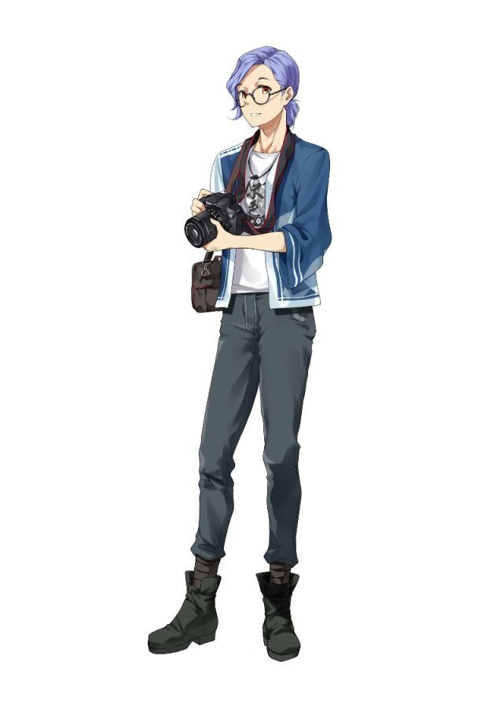

# 原摄坞
缘莺学园摄影队直属原区。这里可以说是缘莺岛的好莱坞，有着许多实力强大的摄影公司和影视制作公司，是全缘莺岛影视作品输出的地方。除此之外，包括余弦剧团、咖红之馆开放日以及各种重大活动的影视制作都是在这里完成的。这里有着很多的拍摄工厂和拍摄场地外，也有很多关于摄影器材的商业店铺，因为这里的居民基本都是摄影爱好者，缘莺岛最杰出的摄影师、灯光师、造型师、灵魂修图大师都聚集于此。

## 角色
### 井学长
  
缘莺学园摄影队队长，也是镜像地带中的知名摄影。  
拥有高挑帅气的外表，经常穿着突显潮流的衣服，看上去是一个非常时尚的潮男。由于其外表因此经常有coser找他约片，因此在女生中有着很高的人气。不过也因为这样，经常会做出一些“渣男”举动，比如说总是会利用自己的魅力说一些好听的话来撩妹，做出一些稍微出格的举动，不过每次都会被米玖看见并被一脚踢飞。  
兴趣是追踪好看的美少女，认为“没有拍到美少女等于侮辱了神圣的器材”，“男人喜欢拍美少女有什么错”，每次都会疯狂地去追求他所认为的美少女“美图”以及蜜汁角度，但是拍摄到的照片总会被米玖给删除掉，而为此秘密安装的摄像头也会被破坏，迄今为止已经有129台设备惨遭各种殉职。  
本人看上去是个花花公子，但是实际上更多是专注于摄影。有着让人惊叹的摄影技术，后期的修图和返图也很快，而且对于初次出镜的coser，或者表演能力稍微差一点的，都能非常耐心地去指导动作、表情。虽然有时候有点变态，但是绝对不会出格，在拍摄到涉及对方隐私的事情的时候会立刻删掉。  
虽然经常被米玖管教，但是心里其实非常感谢她，曾在饭团面前说过，没有她的话自己的镜头一文不值。  

### 米玖
缘莺学园的摄影队队长，但更重要的身份是镜像地带的著名导演。  
外表是典型的成熟御姐，说话有着大叔一样随便的口吻，性格也比较富有个性，看上去有着导演的威严，似乎是个很严厉的人，不过场外还是个很容易相处的人。  
有着对镜头语言的高超应用，善于利用分镜艺术去表达自己想要的主题，是业界中的领军人物。执导过各种cos舞台剧、真人剧的影片，也参与过大电影的拍摄，而且还是缘莺贺年祭的总导演，是能让人仰望的存在。  
虽然看起来很忙，不过她并不经常接工作，很多工作还是在学园内完成的，据本人所说她要是不在井学长就要被抓进监狱了。阿井的一生之敌，总是能破坏他的撩妹企图，并能准确知道他的机位在哪里，能毫不留情地销毁他的仪器，不过事后总是会给他一台新的。  
虽然对阿井很严厉，但是心底里非常信赖他的摄影。  
本人实际上酒量很差，由于工作常会接各种应酬，常常因为酒量不行只能由阿井接回去，有时候酒后会对着阿井发泄各种牢骚和抱怨，因此也只有他知道她强势外表下不为人知的一面。  
虽然看上去很成熟，但是内心反而喜欢卖萌类的日常动画，有偷偷穿上过自己私下买的JK，好几次想过希望阿井帮她摄影但是因为过度害羞所以一直没有说出口。  

### 饭团
缘莺学园摄影队的部委，摄影兼布景师。  
摄影队里唯一算的上正常的人，与其他的人相比没有特别出彩，但是也是非常勤奋认真的人。平时热衷于拍摄各种美丽的风景和瞬间，摄影的范围并不局限于cos或者其他ACG内容。  
本职工作是布景师，负责营造舞台效果和布置外景，在这方面有着不错的技术，经常能想到各种方法去创造出想要的效果，不过本人更想体验的是拍摄的部分。  
对井学长的某些变态举动理解不能，总是试着阻止但是又因为害羞不敢和coser谈话，是一个有一定女性恐惧症的人，因此也总是不会鼓起勇气去试着向coser约片。对于能拍出很美的照片的阿井相当佩服，同时也有着一定的自卑心理。  
某一天在拍摄的时候镜头中偶然出现了一个非常美的背影，从那以后开始萌生了把少女最美的一面拍下来留在胶片里的想法。  

### 萌香
缘莺学园摄影队的部委，摄影兼化妆师。  
有着螺旋卷的双马尾的女孩，有着高超的摄影技术，同时也承担着化妆师的工作。实际上一个重度的lo控，每次化妆的时候总会不知不觉就把小姐姐化成自己想要的lo娘的样子，例如哥特式的马尾或者大小姐一样的公主发。而对拍摄lo娘上也有着疯狂的执念，有时甚至可以说比井学长还要变态。常常会疯狂地在会场里寻找可爱的lo娘，并在各个角度摆拍。  
实际上也是新闻部的部长，本人还有一个兴趣是八卦，非常喜欢各种花边新闻，总是喜欢拍一些让人误会的照片，是个常常让人感到头疼的人。  

