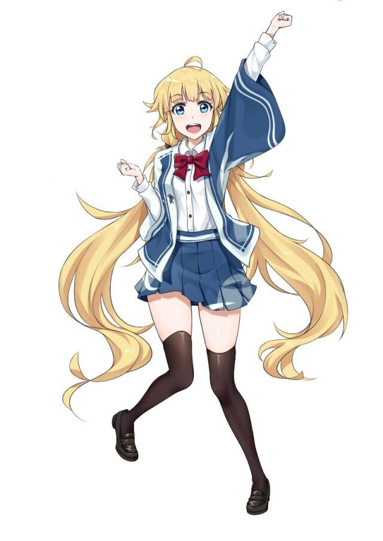
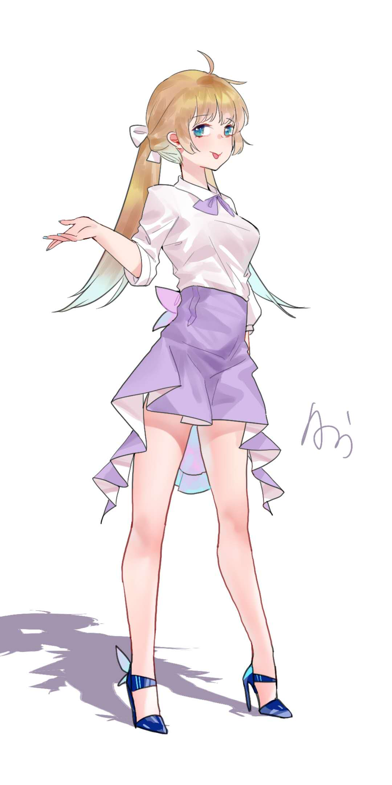
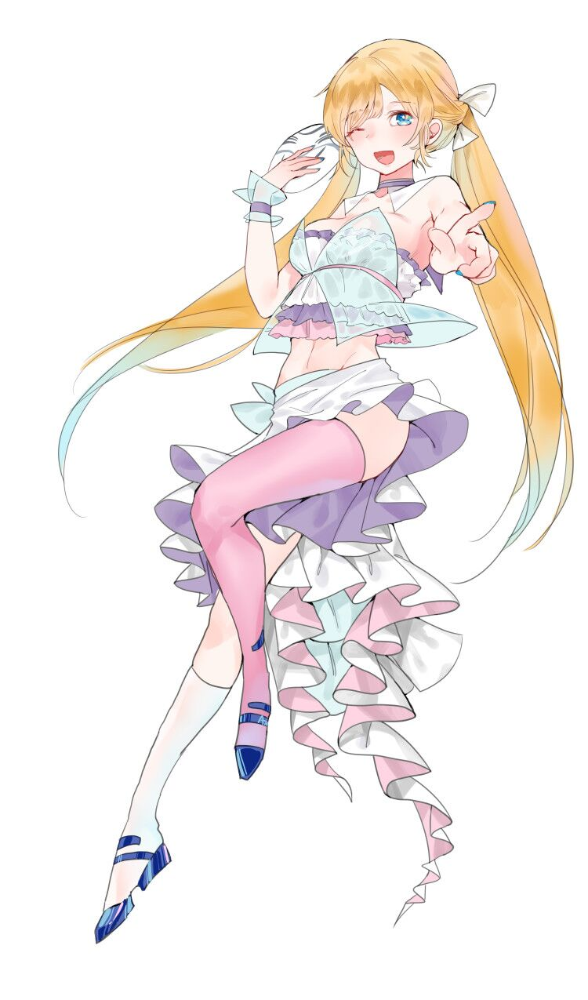

# 原色看板娘

## 缘莺娘
   
缘即缘分，同时也有“元气”的意思。有着如金丝雀一般的金发，个性元气可爱。虽然是女神但是可以以普通缘莺岛居民的身份在缘莺岛上生活着，而这个时候一般自称自己为“阿缘”，也有人称她为“小缘”。由于本身代表着“幸运”，所以本人也有着很高的幸运度，经常能在抽卡的时候十连出SSR，可谓欧气满满。  
“女神是无所不能的，才不是笨蛋！”  
由于本身元气的属性，做事情常常干劲十足，也丝毫不会掩饰自己内心的想法，非常开朗乐观，常常表现出相当天然的一面，因为这个自己经常被人叫做“笨蛋”，也因为这个自己总想证明作为女神是无所不能的，然而最终却还是做出名副其实的“笨蛋行为”。喜欢与别人交朋友，并称相遇为“羁绊之花的盛开”，而这本身也是她作为女神时候的使命之一。  
由于对于很多人来说她的存在太过自然，使得自己常常会被别人无视，因此也经常会抱怨“明明阿缘是女神为什么还要这么过分地无视阿缘啊！”，不过事实上她并不是真的生气，实际上本人确实有着很高的双商，只是自己对人际交往中扮演这样的角色的必要性有着深刻认识，因此也愿意去承担这样的责任。也因为这个原因，常常能以自己的行动无意中影响别人从而改善一段关系，这也算是“羁绊之花”守护者的体现吧。  
本质是缘莺娘的人性与另一个人的融合。有着“深爱着这个世界并想献出自己的一切一直守护着它”的想法的人，在即将从原色世界毕业的时候，理解这个世界的“缘”真正意义时，可以选择成为缘莺娘。在自己与缘莺娘的人格融合后，原来自己关于这个世界所有的羁绊和记忆会被抹除，完全以元气满满的缘莺娘的身份继续为这个世界带来笑容与希望。在成为缘莺娘后不会从这个世界脱离，也就是“毕业”，直到下一位接替者的来临，到那时新的缘莺娘就会诞生，原本缘莺娘的人格与原接替者分离，所有的记忆与羁绊会被归还，同时回到原来的世界后关于原色世界的记忆也不会消失。  
也就是说，“阿缘”本身是缘莺娘在缘莺岛上以原住民身份经历的一个轮回，尽管一代又一代缘莺娘会不断产生，外貌相比之前也会有一定程度的变化，但是元气金发的特征不会改变，同时每一代缘莺娘也保留着重生为缘莺娘之前的自己那部分记忆情感的残渣。  

## 缘
  
  

## 瑛
  
  
  
缘莺娘另一面之一，本身为阿缘的另一个人格。与阿缘不同的是外表有着如雪一般的银发，而且脸庞与缘莺娘表现出来的可爱不同更加地俊俏，曾一度被认为是英俊美丽的美少年。时常穿着如王子一般的白袍出现，甚至吸引了很多女性。  
虽然跟阿缘是同一个人，但是性格更加冷淡沉默，很少主动与人谈话，回答一般也非常简洁，给人一种话少冷酷的印象。两个人格本身能自由转换，但是因为瑛不喜欢社交，所以一般都以阿缘的形象出现，然而当遇到需要力量解决的问题的时候瑛会主动跟阿缘换过来。与阿缘不同，本身就保留了缘莺娘一定程度的力量，所以可以无视原区法则限制自由使用。  
缘莺娘连结【羁绊之花】过程中发现了并不是所有的羁绊之花都会完整的盛开，很多羁绊之花在连结后迅速枯萎，也就是说只有盛开的假象、虚伪的羁绊。由于它大量充斥在羁绊之花中，尽管它们常常相互伤害，缘莺娘也无法轻易让它们枯萎破坏整个羁绊连结的网络，因此从自身中分离出了另一个人格，这个人格封印了关于“真正的羁绊之花”的情感，只为了守护虚伪的羁绊而存在，但自己却无法从中获得幸福，因而慢慢变得冷淡，与本来元气满满的缘莺娘大相径庭——这就是瑛的诞生。她相比阿缘对羁绊的认识更加成熟深入，也因此有种经历一切后对人际交往中大多是虚伪的悲观，不像阿缘那样会主动连结羁绊，只会在她身后一个人默默守护虚伪之花，直到它们自己凋谢，但有必要时会对慢慢造成伤害的羁绊斩除，可以说也代表了羁绊培养过程中“切除”“破坏”这一职能。  
与“阿缘”一样伴随着每一代缘莺娘的轮回，但是保存着缘莺娘与替任者结合时阿缘失去的原人格的所有记忆，不过对记忆的情感依然保留在阿缘身上，而阿缘因为记忆的缺失难以将其唤醒。所以瑛虽然记得原本的自己有着什么样的经历和记忆，但很少对此有很多看法和议论，对她来说这或许更加接近“别人的记忆”，即使如此她有时候自己也会有种难以言状的情愫，只是不善于表达出来。
