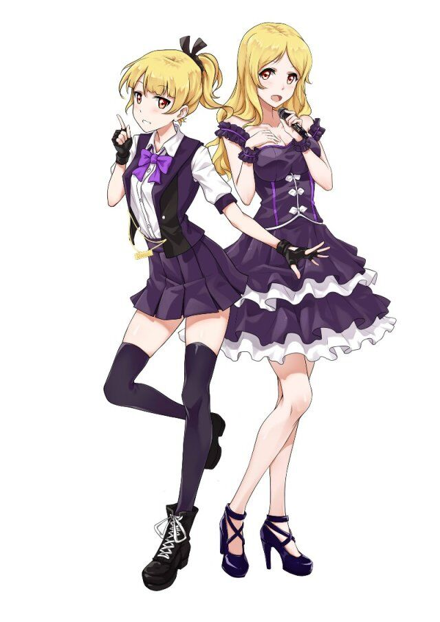

# 莺舞森林
缘莺学园SD部的直属原区。位于缘莺岛最神奇的森林地带。这里是缘莺岛唱见和舞见的聚集区，为全缘莺岛传播着ACG的音乐与舞蹈魅力。虽说是森林，但这里的树木可以被替换成任何世界的场景，比如繁华的都市或者公园一角，又或者奇幻世界中的中世纪街道，科幻世界中的浮游岛等等，一切都是为了演出和录制时的舞台特效。因此名字上虽然叫森林，但大部分的场景都是与舞台有关的东西。原区中心是专门提供练习的地方，有着很多的反光镜和宽阔的空间。这里所有的魔法来自于唱见和舞见表演时的元气，有的还会随风散发到空气中，而这部分力量也经常被隔壁的灵光海滨的居民们利用。

## 角色

### 艾歌
身高：164cm  
体重；48kg  
身份：缘莺学园二年级生  
有着碎金般的金发，缘莺学园的SD部长，实际上也是缘莺岛中人气很高的偶像，与双胞胎妹妹艾舞组成了超人气歌舞组合“Sydan”，在全岛拥有百万级别的粉丝。经常在全岛会有live演出，或者受邀请参加各种活动，是当初无愧的新生代人气偶像。  
本人同时也是“YingYing”的知名唱见，除了发布自己的原创歌曲外也会翻唱各种番剧的op或者ed，其歌声具有鲜明的积极向上的风格，从萌系歌曲到热血歌曲都能熟练驾驭，唱功可谓非常出色。由于其多变的声线，也经常参与动画的声优工作，无论是少女还是正太的声音都能模仿出来，拥有很强的业务能力。  
有着与妹妹不同的，成熟稳重的性格。举止优雅大方，如大小姐一般。看上去虽然非常可靠，但实际上内心经常处于紧绷状态，在登台之前总是会感到非常紧张，甚至一度想要退出表演或者呕吐。曾经在第一次的live中因为过于紧张发挥严重失常，表现出了与录音棚里完全不同的现场唱功，一度缺乏自信，后来被夏沫鼓励后开始磨炼现场唱功与控场能力，现在已经成为非常优秀的歌姬。  
曾经在原世界为高贵的精灵公主，其歌声有着能让动物听从召唤侧耳倾听的能力。本来有着可爱的长耳，但平常时用魔法藏了起来。拥有精灵族本身高超的艺术天赋，在进入原色世界后被初音未来等虚拟歌姬深深吸引，并开始尝试投稿《Secret base》的翻唱成为音乐区up主。后来在艾舞的建议下双子姐妹组成歌舞组合，参加了缘莺岛的偶像大赛。在决赛之前因为过大的压力想要比赛过后退出组合，曾经因为在选曲中与艾舞吵架，后来理解了艾舞想要与自己一直站在同一个舞台的想法，与艾舞约定“Sydan”永不解散。决赛中两人共同演唱《若能绽放光芒》（四慌op），一举夺下冠军，成为了全缘莺岛知名的超级偶像组合。  
本人实际上是个重度妹控，非常喜欢收集艾舞的表情包并挂在床头，甚至会制作成kt板和抱枕，面对艾舞萌到犯规的一面的时候甚至还会摆出“awsl”一样的表情。身为偶像经常被经纪人吐槽“哪里有偶像像个狗仔队一样去偷拍自己妹妹的啊”。非常喜欢睡前故意唱带有魔法催眠效果的曲子哄艾舞睡觉然后欣赏她的睡脸两个小时才睡觉。  
后来在缘莺祭中与SD的各位组成临时Band，担任主唱。

左为艾舞，右为艾歌

### 艾舞
身高：164cm  
体重；48kg  
身份：缘莺学园二年级生  
有着与姐姐艾歌一样的碎金般的头发，不过作为单马尾扎在脑后看起来则更加地活泼元气。  
缘莺学园SD部的部长之一，实际上也是缘莺岛中人气很高的偶像，与双胞胎姐姐艾歌组成了超人气歌舞组合“Sydan”，在全岛拥有百万级别的粉丝。经常在全岛会有live演出，或者受邀请参加各种活动，是当初无愧的新生代人气偶像。  
本人同时也是“YIngYing”的知名舞见，相当高产，经常投稿自己编舞的作品，无论是宅舞或是其他流行舞蹈都能演绎，其舞蹈经常表现出非常强的活力与爆发力，加上本人青春可爱的脸庞，因此有着很高的人气。早期的她虽然舞蹈实力出众，但着装与场景搭配总是显得很外行，自己也不会专门去穿衣打扮，即使如此依然凭借过硬的实力涨粉，后来在艾歌的帮助下开始走偶像化路线，人气开始暴涨。  
与姐姐相比，本人有着一股脑不服输的性格，张扬外向，无论何时都能保持活力展露笑容，总给人一种精神奕奕的感觉。她的干劲总能影响周围的人，是艾歌心目中“永远给她前进动力的天使”。经常在艾歌泄气的时候鼓励艾歌，在舞台上总能给艾歌背后推一把。  
曾经为原世界的精灵公主，其舞蹈有着能让百花盛开树木生长的魔力。与姐姐艾歌一同跟随缘莺传说来到原色世界后，一度被宅舞深深吸引，决心自己投稿成为up主，凭借精灵强大的艺术天赋成为了知名舞蹈区up主后，突然一股脑热想要与艾歌成立偶像组合参加偶像大赛。在决赛开始之前偶然得知艾歌觉得给自己拖了后腿想要退出组合的想法后非常伤心，在选曲的时候两人发生争吵，后来表达出了想与艾歌永远站在同一个舞台上演出的愿望。最后一改之前自己跳舞艾歌唱歌的演出风格，两个人共同以唱和跳的形式演绎了《若能绽放光芒》拿下冠军，而这次比赛也表现出了她不输给艾歌的声音。  
虽然经常能在姐姐困难的时候帮助她，但却在日常生活中对艾歌有习惯性的依赖。经常需要在艾歌的歌声下才能睡着，也很喜欢对艾歌撒娇，或者吃饭的时候让艾歌喂，有时候也喜欢对艾歌恶作剧，但其结果往往都是自己被反过来捉弄，不过这之后的表情却是艾歌最喜欢看到的。  
后来在缘莺祭中与SD的各位组成临时Band，担任吉他手。  

### 冷冰
身高：154cm  
体重；40kg  
身份：缘莺学院二年级生  
缘莺学园SD的部员，其身份是缘莺岛上知名的作曲家。  
个性沉默寡言，即使说话蹦出的语句也非常少，而且很喜欢戴着一副耳机，似乎喜欢沉浸在自己的音乐世界里一样，拒绝与外界交流。  
虽然不是唱见或者舞见，但却是作曲家，精通各种乐器，熟悉各种乐理知识，无论是钢琴、木笛等古典乐器还是吉他、贝斯等现代乐器都非常拿手。作为作曲者为很多动画、影视作品编曲，也经常为艾歌和艾舞的原创专辑作曲，是这两人背后成功的王牌。  
对音乐有着很深的理解，虽然不是像艾歌艾舞那样是精灵，但是其音乐天赋完全不输于她们。有着超强的“绝对音感”，能分辨出曲子里的乐器与声音的好坏，其音乐注重对人的理解，考虑人的心理感受，因此作曲往往有强大的震撼心灵的力量。  
其曲风多变，被人称作“冰冷魔女”，有着怪物一样的强烈转化。其曲子涵盖静谧向的白噪音到震撼向的史诗纯音，总会让人感觉不是出自同一个人之手。除了平常的作曲外，也经常使用VOCALOID写歌，并在“YingYing”上投稿，其作品后来也有很多被真人翻唱，比较常用的虚拟歌姬是初音未来，其作品曾被艾歌听到并让她开始自己的演艺生涯，某种意义上是艾歌的引路人，也因此被艾歌所仰慕着。  
本人虽然时常表现出毫无表情的冰冷，但内心相当细腻，非常关心歌舞姐妹，总能在关键时刻给她们意想不到的帮助，但本人对艾舞过于活泼的风格没辙，总是被艾舞拉去拜托各种麻烦事，但本人很少拒绝。
平时喜欢喝低糖的咖啡，比较喜欢森林这样静谧的地方，这也是她进入莺舞森林的原因。虽然是天才但生活方面的自理能力很差，不会洗衣服也不会做饭，家里除了乐谱和乐器，其他东西的摆放都一团糟。
在缘莺祭中与SD的各位临时组成band，担任了band中的键盘手。  

### 杆菌
身高：156cm  
体重：41kg  
身份：缘莺学院三年级生  
缘莺学园SD的前部长，是一位鼓手。  
外表看上去散发着成熟男性的魅力而且可靠，脸上总会挂着爽朗的笑容，总会穿着突显肌肉的运动背心，看上去像是流行乐队的成员一样。  
实际上确实很会玩乐器，虽然造诣不及冷冰但是玩得贼溜，非常喜欢玩吉他或者玩鼓，同时也是音游大佬，兴趣是每周在太鼓上刷分，有着相当快的手速。也因为这个特长，经常在Band中担任鼓手。
实际上本人也能同时担任唱见和舞见，擅长演唱高音而且爆发力强的热血向歌曲，有着非常足的气量去演唱高难度歌曲，声音也相当具有震慑力。而舞蹈方面偏街舞风，但居然也能以肌肉男的形象沉醉其中地跳如《爱之诗》这样的萌系宅舞，一度让众人心情复杂。  
虽然外表看起来很威猛但也是一个善解人意的男性，作为前辈时常给歌舞姐妹指导和鼓励，有的时候会很不正经但也是个相当可靠的家伙。  
对于女装这个事情态度非常耐人寻味，似乎不会掩饰自己的兴趣，说“哎呀要是没人女装祭天的话那我就勉为其难地帮一下忙吧”，甚至还被人看到不动声色地进入女装祭天服装店，饶有兴趣地挑选女装。

<!--
### 缘莺
  
身份：虚拟歌姬  
为莺舞森林官方根据缘莺娘的形象设计的虚拟歌姬，在正式推出后宣布她将加入缘莺学园SD部入学。一开始被人以为是V家的偶像读作“缘音”，后来官方澄清缘莺的声音由自行开发的软件合成。普遍认为其音源为莺舞森林前著名唱见琉觞。在推出后迅速火爆网络，并有多位调音师推出歌曲，其中也包括音乐区著名up主冷冰。冷冰推出的多首曲子都成为缘莺的代表曲，并在后来被超人气偶像组合“Sydan”现场翻唱。
有着相当高的人气，有着独特的粉丝团体“小黑人”，曾在贺年祭中以全息技术亮相现场舞台，并在台下受到粉丝们气氛热烈的打call。  
-->